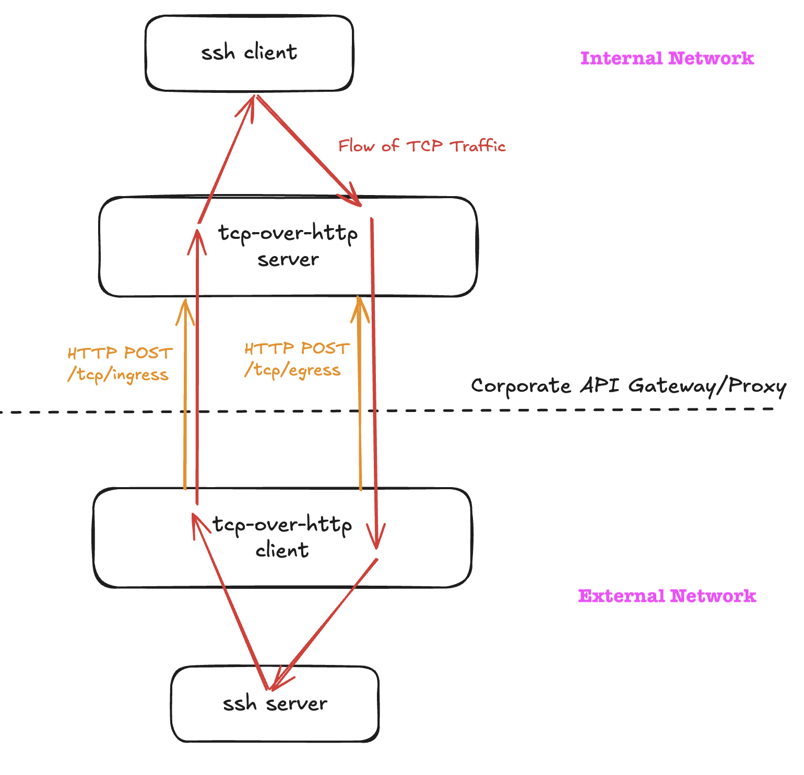

# TCP Over HTTP

## Introduction

Tunnel TCP over an HTTP connection.

This is useful if you have a corporate proxy or api gateway that only allows HTTP(S) traffic && you're able to deploy code on both sides of that gateway.



**THIS CODE IS NOT PRODUCTION READY. IT IS A PROOF OF CONCEPT. Many values are hardcoded like timeouts and content-lengths**

## Usage

Install deps:

```bash
npm i
```

`telnet` example:

```bash
# In terminal 1
docker run -it --rm -p 22:9000 istio/tcp-echo-server

# In terminal 2
tsx client.ts

# In terminal 3
tsx server.ts

# In terminal 4
telnet localhost 8000
> hi
```

`ssh` example:

```bash
# clean ~/.ssh/known_hosts
grep -v 'localhost' ~/.ssh/known_hosts > /tmp/known_hosts
mv /tmp/known_hosts ~/.ssh/known_hosts

# In terminal 1
docker run -it --rm \
  -e USER_NAME=fish \
  -e USER_PASSWORD=pizza \
  -e PASSWORD_ACCESS=true \
  -p 22:2222 \
  linuxserver/openssh-server

# In terminal 2
tsx client.ts

# In terminal 3
tsx server.ts

# In terminal 4
ssh fish@localhost -p 8000
# password is "pizza"
```
